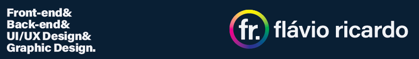

  

<h1 align="center">Olá, eu sou o Flavio Ricardo! 👋</h1>

  <strong>Full Stack Developer & UI/UX Designer</strong> 
  Transformando ideias visuais em código limpo, eficiente e de alto impacto.

  
  
  
  
  
  

---

### 💻 Full Stack Development

  
  
  
  
  
  
  
  
  

### 🎨 UI/UX & Graphic Design

  
  
  
  
  
  
  

### ⚙️ Ambientes & Sistemas Operacionais

  
  
  

---

<h3 align="center">📊 GitHub Stats & Atividade</h3>

  
  

 

  

